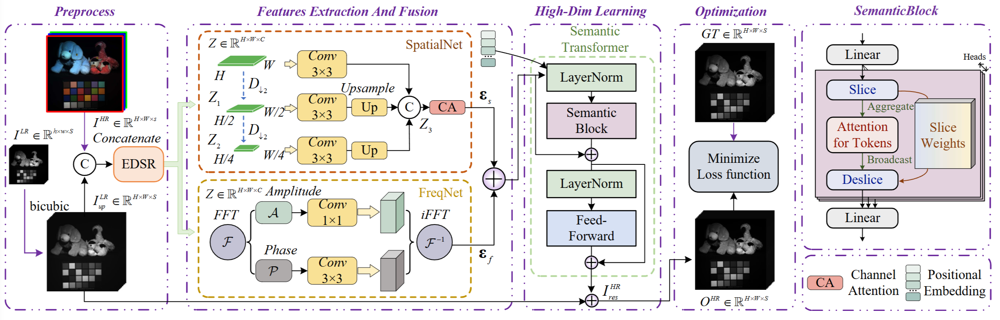

<div align="center">
  <h1>🔬 SpecSolver</h1>
  <h3>Solving Spatial–Spectral Fusion via Semantic Transformer</h3>
  
  **Wei Li**<sup>1</sup>, **Junwei Zhu**<sup>1</sup>, **Honghui Xu**<sup>1</sup>, **Jiawei Jiang**<sup>1</sup>, **Jianwei Zheng**<sup>1</sup><br>
  <sup>1</sup>Zhejiang University of Technology  
  ✉️ Corresponding author: [zhengjianwei2@zjut.edu.cn](mailto:zhengjianwei2@zjut.edu.cn)
</div>

---

## 🚀 ACMMM 2025 News _(2025-07-05)_

> 🎉 **Exciting Announcement!** SpecSolver has been officially accepted to ACM Multimedia (ACMMM) 2025.
> Our open-source repository is under active development—stay tuned for the camera-ready paper, code releases, and pretrained models!

---

## 📋 Roadmap & To-dos

- [ ] Publish **camera-ready** version of the paper and supplementary materials
- [ ] Publication citation format
- [ ] Open-source the complete **codebase** and **pretrained weights**
- [x] ✅ Release **dataset** for reproducible experiments

> **Tip:** ⭐ Star our repository to receive updates on releases and new features.

---

## 🔍 Introduction



Semantic transformer-based solvers like SpecSolver draw inspiration from superpixel segmentation but overcome its limitations in spatial–spectral fusion (SSF). Our framework:

1. **Semantic Slicing:** Learns _flexible_ pixel groupings (slices) through a novel **Semantic-Attention** mechanism, ensuring differentiability and end-to-end training.
2. **Token Encoding:** Transforms each slice into a **Semantic-Superpixel token**, capturing rich spatial and spectral cues.
3. **Transformer Solver:** Applies attention across tokens to model long-range dependencies efficiently, **supporting multiple upscaling factors** with linear complexity.

> **Why SpecSolver?**
> - ⚡ **Efficiency:** Linear computational cost in the number of pixels
> - 🌟 **Flexibility:** Adaptive slice shapes tuned to semantic content
> - 🎯 **Accuracy:** State-of-the-art performance on standard SSF benchmarks


## ✨Quick Start

Follow these steps to train and test the SpecSolver models with a scaling factor of 4:

1. **Train on CAVE dataset**

   ```bash
   python -m Train.SpectralSolver_Train_cave --sf 4

2. **Test on CAVE dataset**

   ```bash
   python -m Test.SpectralSolver_Test_cave --sf 4

3. **Train on Harvard dataset**

   ```bash
   python -m Train.SpectralSolver_Train_Harvard --sf 4

4. **Test on Harvard dataset**

   ```bash
   python -m Test.SpectralSolver_Test_harvard --sf 4

---

## 📊 Public Datasets

| Dataset     | Download Link                                                                                          | Extraction Code |
|-------------|--------------------------------------------------------------------------------------------------------|-----------------|
| **CAVE**    | [⬇️ Download CAVE Dataset](https://pan.baidu.com/share/init?surl=CXCJfzp2yfvJZ9Lg2i-mNA)                 | `dju8`          |
| **Harvard** | [⬇️ Download Harvard Dataset](https://pan.quark.cn/s/2d9032ebafaf)                                       | `aque`          |

> 💡 **Tip:**  
> Your folder structure should look like:
> ```
> ./Cavedataset/
> ├── Train
> └── Test
> ```

---

## 📚 Citation

If **SpecSolver** contributes to your research, please cite:

```bibtex


